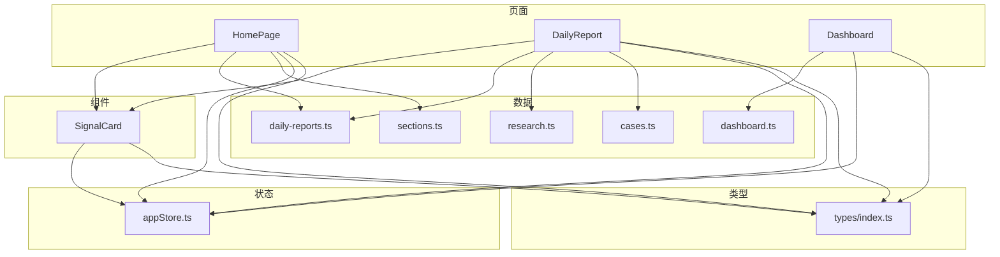
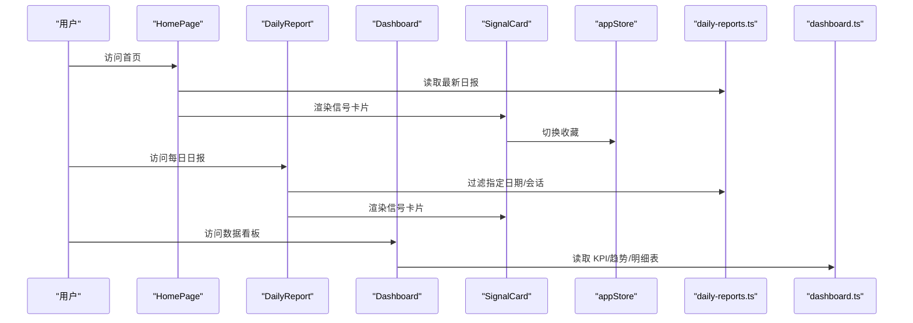
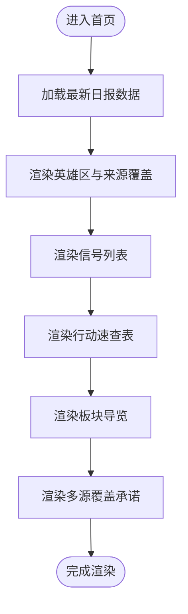
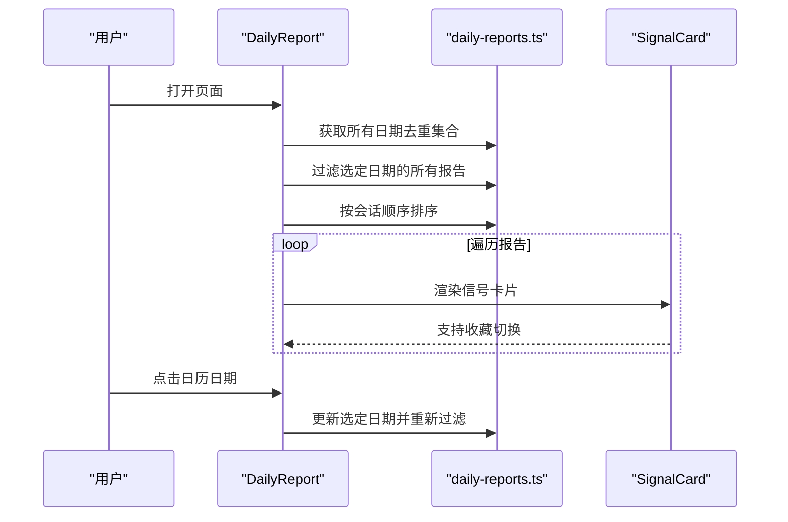
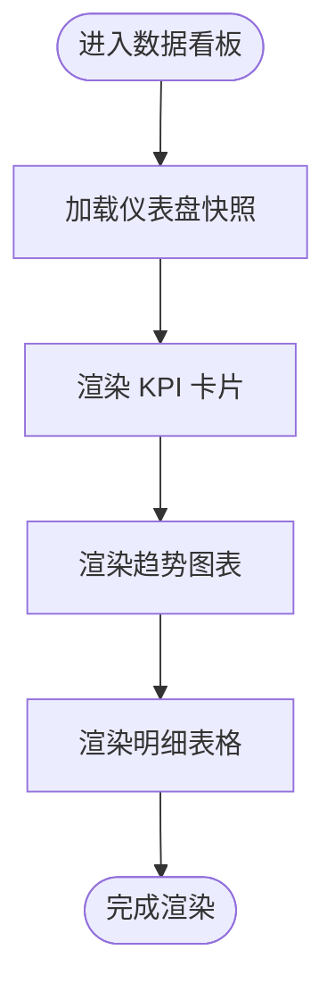
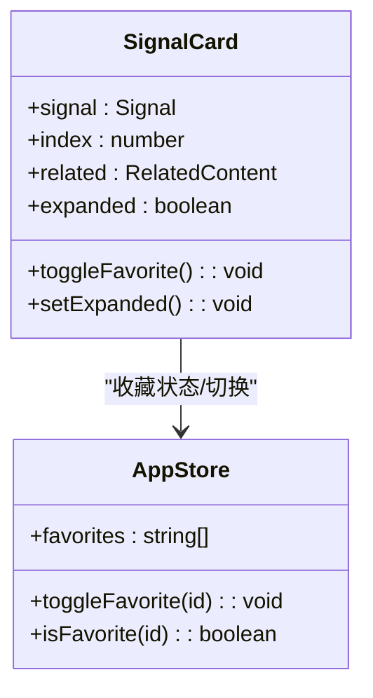
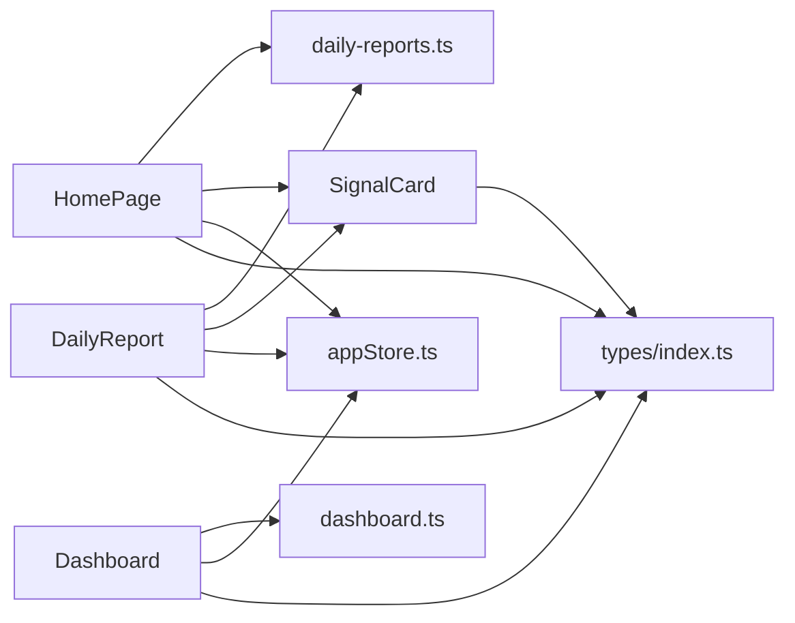

# 核心页面

<cite>
**本文引用的文件**
- [HomePage/index.tsx](file://src/pages/HomePage/index.tsx)
- [DailyReport/index.tsx](file://src/pages/DailyReport/index.tsx)
- [Dashboard/index.tsx](file://src/pages/Dashboard/index.tsx)
- [SignalCard/index.tsx](file://src/components/SignalCard/index.tsx)
- [appStore.ts](file://src/stores/appStore.ts)
- [daily-reports.ts](file://src/data/daily-reports.ts)
- [dashboard.ts](file://src/data/dashboard.ts)
- [sections.ts](file://src/data/sections.ts)
- [research.ts](file://src/data/research.ts)
- [cases.ts](file://src/data/cases.ts)
- [index.ts](file://src/types/index.ts)
</cite>

## 目录
1. [简介](#简介)
2. [项目结构](#项目结构)
3. [核心组件](#核心组件)
4. [架构总览](#架构总览)
5. [详细组件分析](#详细组件分析)
6. [依赖关系分析](#依赖关系分析)
7. [性能考量](#性能考量)
8. [故障排查指南](#故障排查指南)
9. [结论](#结论)
10. [附录](#附录)

## 简介
本文件聚焦于三个核心页面的功能与实现：
- 首页：角色推荐系统、信号展示、行动规划、板块导览与多源覆盖承诺
- 每日日报：信号列表、优先级显示、来源覆盖、会话分类与日历选择器
- 数据看板：KPI 面板、趋势图表、关键指标与明细表格

文档涵盖页面布局设计、组件组合模式、数据绑定方式、用户交互流程，并提供最佳实践与性能优化建议，帮助开发者快速理解与维护这些页面。

## 项目结构
- 页面层：HomePage、DailyReport、Dashboard
- 组件层：SignalCard（信号卡片）
- 数据层：daily-reports、dashboard、sections、research、cases
- 状态层：appStore（主题、角色、收藏、搜索、标签过滤）
- 类型定义：types/index.ts

**图表来源**
- [HomePage/index.tsx:1-226](file://src/pages/HomePage/index.tsx#L1-L226)
- [DailyReport/index.tsx:1-263](file://src/pages/DailyReport/index.tsx#L1-L263)
- [Dashboard/index.tsx:1-208](file://src/pages/Dashboard/index.tsx#L1-L208)
- [SignalCard/index.tsx:1-174](file://src/components/SignalCard/index.tsx#L1-L174)
- [appStore.ts:1-93](file://src/stores/appStore.ts#L1-L93)
- [daily-reports.ts:1-455](file://src/data/daily-reports.ts#L1-L455)
- [dashboard.ts:1-79](file://src/data/dashboard.ts#L1-L79)
- [sections.ts:1-12](file://src/data/sections.ts#L1-L12)
- [research.ts:1-56](file://src/data/research.ts#L1-L56)
- [cases.ts:1-63](file://src/data/cases.ts#L1-L63)
- [index.ts:1-218](file://src/types/index.ts#L1-L218)

**章节来源**
- [HomePage/index.tsx:1-226](file://src/pages/HomePage/index.tsx#L1-L226)
- [DailyReport/index.tsx:1-263](file://src/pages/DailyReport/index.tsx#L1-L263)
- [Dashboard/index.tsx:1-208](file://src/pages/Dashboard/index.tsx#L1-L208)

## 核心组件
- SignalCard：展示信号标题、摘要、优先级、标签、来源、详情折叠、相关公司/研究/案例链接，支持收藏切换
- appStore：全局状态（主题、角色、阅读历史、收藏、搜索、标签过滤）

这些组件与页面紧密协作，形成统一的数据流与交互体验。

**章节来源**
- [SignalCard/index.tsx:1-174](file://src/components/SignalCard/index.tsx#L1-L174)
- [appStore.ts:1-93](file://src/stores/appStore.ts#L1-L93)

## 架构总览
三个页面均通过类型定义的接口消费数据层，页面负责渲染与交互，组件负责可复用的 UI 片段，状态层提供跨页面共享的状态。

**图表来源**
- [HomePage/index.tsx:38-104](file://src/pages/HomePage/index.tsx#L38-L104)
- [DailyReport/index.tsx:56-78](file://src/pages/DailyReport/index.tsx#L56-L78)
- [Dashboard/index.tsx:8-50](file://src/pages/Dashboard/index.tsx#L8-L50)
- [SignalCard/index.tsx:33-68](file://src/components/SignalCard/index.tsx#L33-L68)
- [appStore.ts:35-81](file://src/stores/appStore.ts#L35-L81)
- [daily-reports.ts:1-455](file://src/data/daily-reports.ts#L1-L455)
- [dashboard.ts:1-79](file://src/data/dashboard.ts#L1-L79)

## 详细组件分析

### 首页（HomePage）
- 角色推荐系统
  - 基于用户角色映射不同导航路径，点击按钮设置当前角色并高亮选中态
  - 与 appStore 的角色状态联动，支持持久化
- 信号展示
  - 展示最新日报中的信号列表，每个信号通过 SignalCard 渲染
  - SignalCard 支持详情折叠、优先级徽章、标签、来源信息、收藏切换
- 行动规划
  - 展示“本周 HR 行动速查”，表格形式呈现优先级、行动、时间窗、依据
- 板块导览
  - 7 大板块网格展示，包含图标、标题、描述、内容数量
- 多源覆盖承诺
  - 展示权威来源覆盖情况，强调多源基线与达标状态

**图表来源**
- [HomePage/index.tsx:38-193](file://src/pages/HomePage/index.tsx#L38-L193)

**章节来源**
- [HomePage/index.tsx:12-17](file://src/pages/HomePage/index.tsx#L12-L17)
- [HomePage/index.tsx:27-36](file://src/pages/HomePage/index.tsx#L27-L36)
- [HomePage/index.tsx:38-104](file://src/pages/HomePage/index.tsx#L38-L104)
- [HomePage/index.tsx:106-137](file://src/pages/HomePage/index.tsx#L106-L137)
- [HomePage/index.tsx:139-160](file://src/pages/HomePage/index.tsx#L139-L160)
- [HomePage/index.tsx:162-193](file://src/pages/HomePage/index.tsx#L162-L193)
- [HomePage/index.tsx:195-222](file://src/pages/HomePage/index.tsx#L195-L222)

### 每日日报（DailyReport）
- 信号列表与优先级显示
  - 每条信号通过 SignalCard 渲染，包含优先级徽章、标签、来源、详情折叠、相关公司/研究/案例链接
- 来源覆盖
  - 展示当日报告的权威源总数、覆盖类别数、是否达标
- 会话分类
  - 支持 AM/PM/自动版/可视化四种会话，按固定顺序排序
- 日历选择器
  - 月历网格展示可选日期，标记有报告的日期，支持上一月/下一月切换
  - 选中日期后按会话顺序渲染报告块

**图表来源**
- [DailyReport/index.tsx:56-78](file://src/pages/DailyReport/index.tsx#L56-L78)
- [DailyReport/index.tsx:100-176](file://src/pages/DailyReport/index.tsx#L100-L176)
- [DailyReport/index.tsx:187-253](file://src/pages/DailyReport/index.tsx#L187-L253)
- [SignalCard/index.tsx:33-68](file://src/components/SignalCard/index.tsx#L33-L68)

**章节来源**
- [DailyReport/index.tsx:10-17](file://src/pages/DailyReport/index.tsx#L10-L17)
- [DailyReport/index.tsx:19-29](file://src/pages/DailyReport/index.tsx#L19-L29)
- [DailyReport/index.tsx:38-46](file://src/pages/DailyReport/index.tsx#L38-L46)
- [DailyReport/index.tsx:56-78](file://src/pages/DailyReport/index.tsx#L56-L78)
- [DailyReport/index.tsx:100-176](file://src/pages/DailyReport/index.tsx#L100-L176)
- [DailyReport/index.tsx:187-253](file://src/pages/DailyReport/index.tsx#L187-L253)

### 数据看板（Dashboard）
- KPI 面板
  - 6 个 KPI 卡片，展示指标值、单位、变化率与趋势图标
- 趋势图表
  - 使用 Recharts 展示两条时间序列趋势，支持响应式容器与图例
- 明细表格
  - 可展开/收起的明细表，包含列头、行数据、同比变化徽章、数据来源与 HR 洞察

**图表来源**
- [Dashboard/index.tsx:8-50](file://src/pages/Dashboard/index.tsx#L8-L50)
- [Dashboard/index.tsx:52-89](file://src/pages/Dashboard/index.tsx#L52-L89)
- [Dashboard/index.tsx:91-107](file://src/pages/Dashboard/index.tsx#L91-L107)

**章节来源**
- [Dashboard/index.tsx:8-18](file://src/pages/Dashboard/index.tsx#L8-L18)
- [Dashboard/index.tsx:29-50](file://src/pages/Dashboard/index.tsx#L29-L50)
- [Dashboard/index.tsx:52-89](file://src/pages/Dashboard/index.tsx#L52-L89)
- [Dashboard/index.tsx:91-107](file://src/pages/Dashboard/index.tsx#L91-L107)

### SignalCard 组件
- 结构与交互
  - 头部：表情、标题、优先级徽章、来源名称、收藏按钮
  - 摘要：简短总结
  - 标签：可选
  - 详情：可折叠展开
  - 关联：相关公司、研究论文、转型案例的链接
- 状态与样式
  - 优先级边框与徽章颜色区分
  - 收藏状态来自 appStore

**图表来源**
- [SignalCard/index.tsx:33-68](file://src/components/SignalCard/index.tsx#L33-L68)
- [appStore.ts:60-67](file://src/stores/appStore.ts#L60-L67)

**章节来源**
- [SignalCard/index.tsx:19-31](file://src/components/SignalCard/index.tsx#L19-L31)
- [SignalCard/index.tsx:33-68](file://src/components/SignalCard/index.tsx#L33-L68)
- [SignalCard/index.tsx:76-108](file://src/components/SignalCard/index.tsx#L76-L108)
- [SignalCard/index.tsx:110-170](file://src/components/SignalCard/index.tsx#L110-L170)

## 依赖关系分析
- 页面与数据
  - HomePage/DailyReport 依赖 daily-reports.ts 提供信号、行动规划、来源覆盖
  - Dashboard 依赖 dashboard.ts 提供 KPI、趋势、明细表
- 页面与组件
  - HomePage/DailyReport 通过 SignalCard 渲染信号，复用收藏、详情折叠等交互
- 页面与状态
  - 三页面均使用 appStore 管理收藏、角色、主题等状态
- 页面与类型
  - 所有页面与组件均遵循 types/index.ts 中的接口定义

**图表来源**
- [HomePage/index.tsx:1-11](file://src/pages/HomePage/index.tsx#L1-L11)
- [DailyReport/index.tsx:1-9](file://src/pages/DailyReport/index.tsx#L1-L9)
- [Dashboard/index.tsx:1-6](file://src/pages/Dashboard/index.tsx#L1-L6)
- [SignalCard/index.tsx:1-6](file://src/components/SignalCard/index.tsx#L1-L6)
- [appStore.ts:1-3](file://src/stores/appStore.ts#L1-L3)
- [daily-reports.ts:1-3](file://src/data/daily-reports.ts#L1-L3)
- [dashboard.ts:1-2](file://src/data/dashboard.ts#L1-L2)
- [index.ts:1-218](file://src/types/index.ts#L1-L218)

**章节来源**
- [HomePage/index.tsx:1-11](file://src/pages/HomePage/index.tsx#L1-L11)
- [DailyReport/index.tsx:1-9](file://src/pages/DailyReport/index.tsx#L1-L9)
- [Dashboard/index.tsx:1-6](file://src/pages/Dashboard/index.tsx#L1-L6)
- [SignalCard/index.tsx:1-6](file://src/components/SignalCard/index.tsx#L1-L6)
- [appStore.ts:1-3](file://src/stores/appStore.ts#L1-L3)
- [daily-reports.ts:1-3](file://src/data/daily-reports.ts#L1-L3)
- [dashboard.ts:1-2](file://src/data/dashboard.ts#L1-L2)
- [index.ts:1-218](file://src/types/index.ts#L1-L218)

## 性能考量
- 渲染优化
  - 使用 Framer Motion 的延迟动画，避免一次性大量元素渲染造成卡顿
  - SignalCard 对详情区域采用折叠渲染，减少 DOM 开销
- 数据过滤与排序
  - DailyReport 使用 useMemo 缓存日期集合与按会话排序的结果，降低重复计算
- 图表性能
  - Dashboard 使用响应式容器与轻量 Tooltip，避免复杂交互导致的重绘
- 状态持久化
  - appStore 使用持久化中间件，减少刷新后的状态丢失与重计算

最佳实践建议
- 对大数据集的列表渲染启用虚拟滚动或分页
- 将昂贵的计算放入 useMemo/useCallback，避免不必要的重渲染
- 图表数据尽量精简字段，仅传递必要属性
- 使用 Suspense 或骨架屏提升首屏体验

[本节为通用指导，不直接分析具体文件，故无章节来源]

## 故障排查指南
- 信号详情无法展开
  - 检查 SignalCard 的 detail 字段是否存在，以及展开按钮事件绑定
- 收藏状态不同步
  - 确认 appStore 的 toggleFavorite/isFavorite 是否正确调用与持久化
- 日历日期不可选
  - 检查日期格式与 dateSet 的构建逻辑，确保 selectedDate 与日历日期一致
- 图表空白
  - 确认数据字段名与 Recharts 组件的 dataKey 一致，检查容器尺寸与响应式配置

**章节来源**
- [SignalCard/index.tsx:90-108](file://src/components/SignalCard/index.tsx#L90-L108)
- [appStore.ts:60-67](file://src/stores/appStore.ts#L60-L67)
- [DailyReport/index.tsx:150-173](file://src/pages/DailyReport/index.tsx#L150-L173)
- [Dashboard/index.tsx:63-86](file://src/pages/Dashboard/index.tsx#L63-L86)

## 结论
首页、每日日报与数据看板通过统一的数据模型与组件化设计，实现了清晰的信息层级与高效的用户交互。SignalCard 作为核心展示组件，承载了丰富的信号信息与交互能力；appStore 提供跨页面状态管理；类型系统保证了数据一致性。建议在后续迭代中进一步优化大数据渲染与图表性能，并完善搜索与标签过滤能力，以提升整体用户体验。

[本节为总结性内容，不直接分析具体文件，故无章节来源]

## 附录
- 数据来源类型与接口定义参见 types/index.ts
- 示例数据参见 daily-reports.ts、dashboard.ts、sections.ts、research.ts、cases.ts

**章节来源**
- [index.ts:1-218](file://src/types/index.ts#L1-L218)
- [daily-reports.ts:1-455](file://src/data/daily-reports.ts#L1-L455)
- [dashboard.ts:1-79](file://src/data/dashboard.ts#L1-L79)
- [sections.ts:1-12](file://src/data/sections.ts#L1-L12)
- [research.ts:1-56](file://src/data/research.ts#L1-L56)
- [cases.ts:1-63](file://src/data/cases.ts#L1-L63)