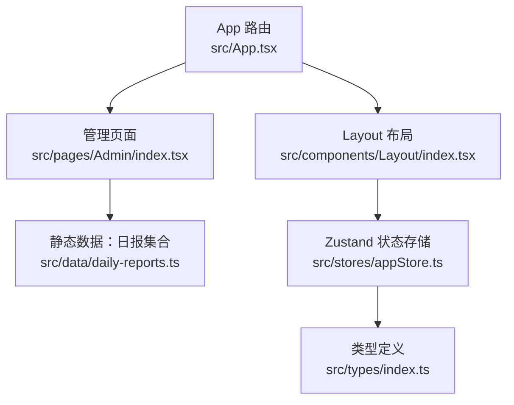
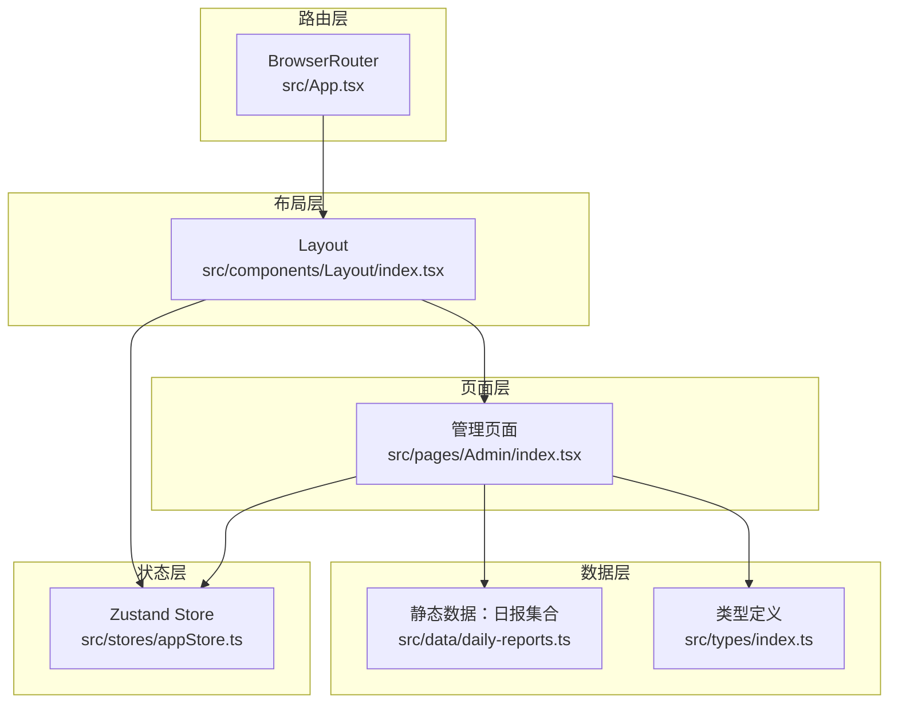
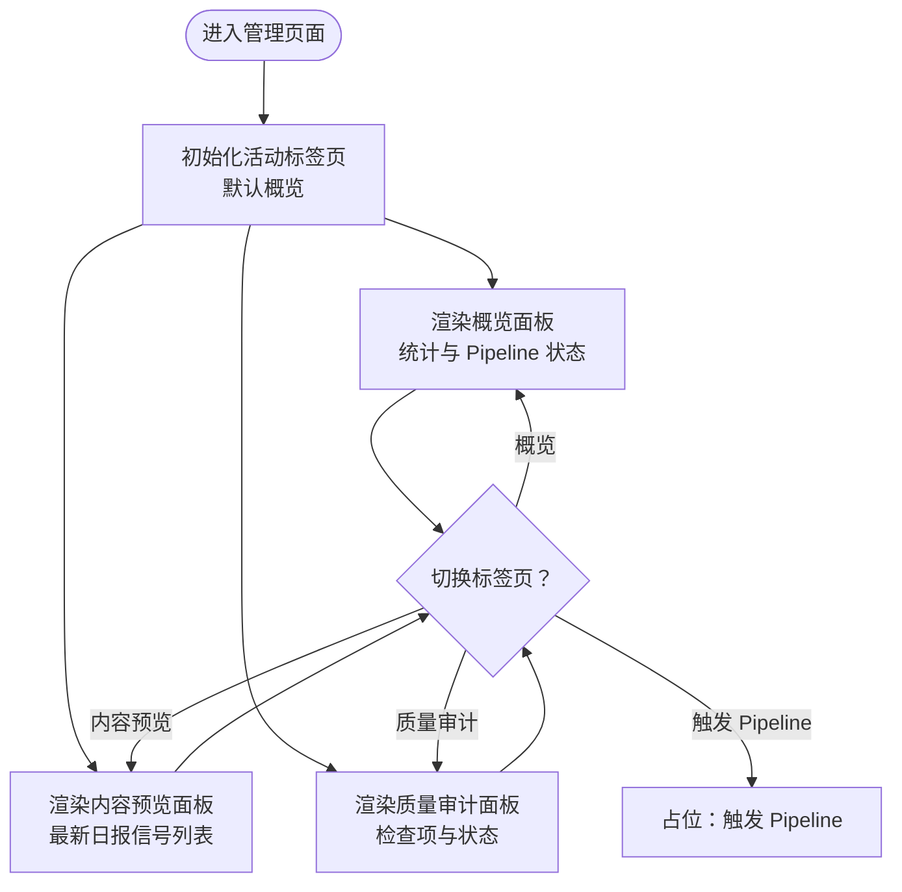
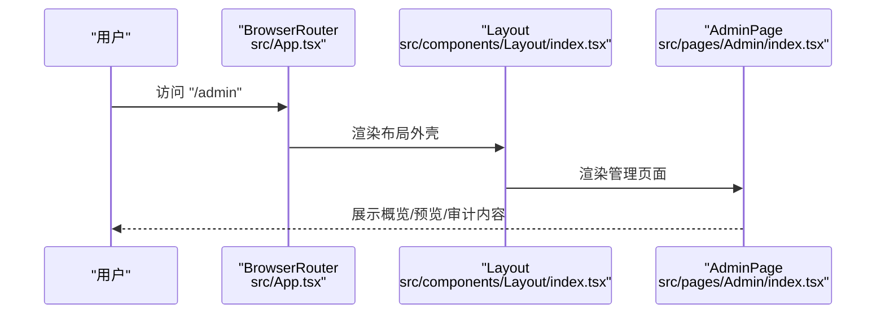
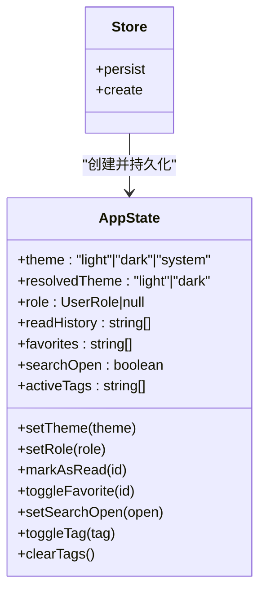
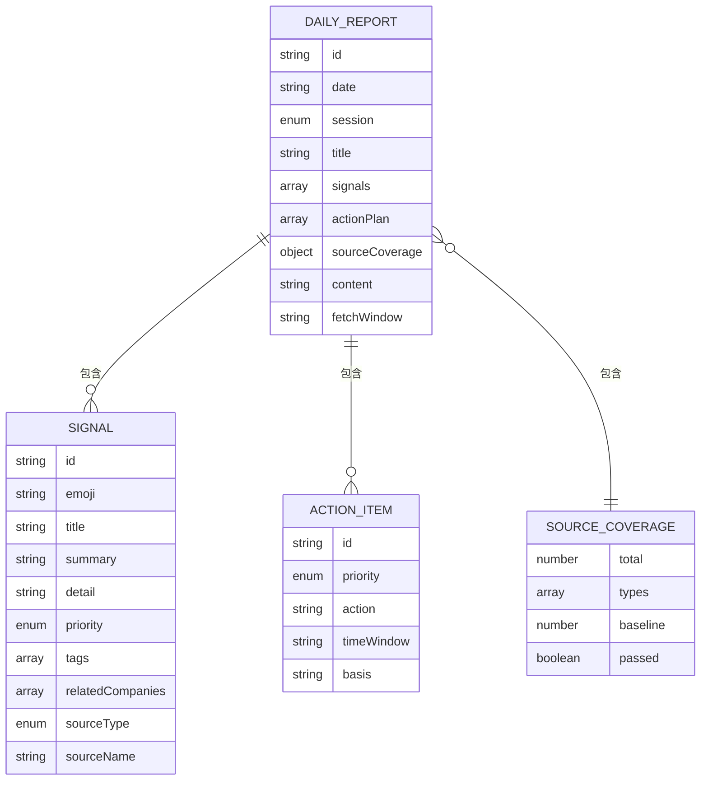
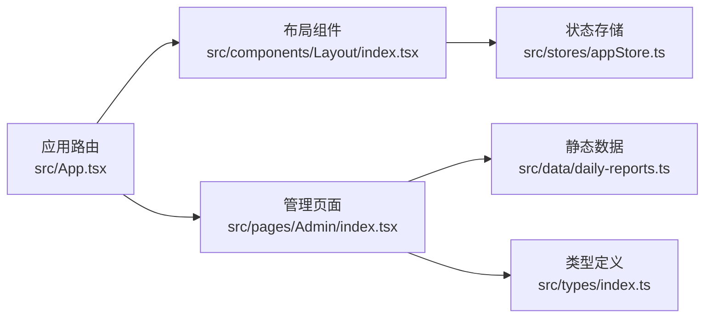

# 管理页面

<cite>
**本文引用的文件**
- [src/pages/Admin/index.tsx](file://src/pages/Admin/index.tsx)
- [src/App.tsx](file://src/App.tsx)
- [src/components/Layout/index.tsx](file://src/components/Layout/index.tsx)
- [src/stores/appStore.ts](file://src/stores/appStore.ts)
- [src/types/index.ts](file://src/types/index.ts)
- [src/data/daily-reports.ts](file://src/data/daily-reports.ts)
- [scripts/import-markdown.ts](file://scripts/import-markdown.ts)
</cite>

## 目录
1. [简介](#简介)
2. [项目结构](#项目结构)
3. [核心组件](#核心组件)
4. [架构总览](#架构总览)
5. [组件详解](#组件详解)
6. [依赖关系分析](#依赖关系分析)
7. [性能考量](#性能考量)
8. [故障排查指南](#故障排查指南)
9. [结论](#结论)
10. [附录](#附录)

## 简介
本文件面向“管理页面”组件的实现与使用，围绕管理员界面的功能展开，重点涵盖内容管理、质量审计、Pipeline 控制、用户角色与权限、系统配置、数据分析与可视化、认证与权限验证、操作日志记录、开发规范、安全考虑、性能监控、与后端 API 的集成方式、数据同步策略以及批量操作实现。  
当前仓库中的管理页面以静态数据驱动为主，提供概览、内容预览与质量审计三大板块，并预留了触发 Pipeline 的入口按钮。后续可在此基础上接入真实后端 API 与权限体系。

## 项目结构
管理页面位于前端路由的“/admin”路径，由应用根路由统一挂载，配合全局布局组件渲染导航、主题切换与搜索入口。状态管理采用 Zustand，持久化存储主题、用户角色、收藏与阅读历史等信息。

图表来源
- [src/App.tsx:14-34](file://src/App.tsx#L14-L34)
- [src/components/Layout/index.tsx:22-174](file://src/components/Layout/index.tsx#L22-L174)
- [src/pages/Admin/index.tsx:6-143](file://src/pages/Admin/index.tsx#L6-L143)
- [src/data/daily-reports.ts:1-455](file://src/data/daily-reports.ts#L1-L455)
- [src/stores/appStore.ts:1-93](file://src/stores/appStore.ts#L1-L93)
- [src/types/index.ts:1-218](file://src/types/index.ts#L1-L218)

章节来源
- [src/App.tsx:14-34](file://src/App.tsx#L14-L34)
- [src/components/Layout/index.tsx:22-174](file://src/components/Layout/index.tsx#L22-L174)
- [src/pages/Admin/index.tsx:6-143](file://src/pages/Admin/index.tsx#L6-L143)
- [src/stores/appStore.ts:1-93](file://src/stores/appStore.ts#L1-L93)
- [src/types/index.ts:1-218](file://src/types/index.ts#L1-L218)
- [src/data/daily-reports.ts:1-455](file://src/data/daily-reports.ts#L1-L455)

## 核心组件
- 管理页面容器：负责三大标签页（概览、内容预览、质量审计）的切换与渲染，展示 Pipeline 状态与质量检查结果。
- 应用路由与布局：统一注册路由、挂载全局布局与搜索模态框，提供主题切换与键盘快捷键支持。
- 状态存储：集中管理主题、用户角色、阅读历史、收藏、搜索状态与标签过滤器，支持持久化。
- 数据模型：定义日报、信号、行动项、来源覆盖等核心数据结构，支撑管理页面的数据展示与审计逻辑。
- 数据导入脚本：将 Markdown 原始内容转换为结构化 JSON 数据，供前端静态数据模块使用。

章节来源
- [src/pages/Admin/index.tsx:6-143](file://src/pages/Admin/index.tsx#L6-L143)
- [src/App.tsx:14-34](file://src/App.tsx#L14-L34)
- [src/components/Layout/index.tsx:22-174](file://src/components/Layout/index.tsx#L22-L174)
- [src/stores/appStore.ts:1-93](file://src/stores/appStore.ts#L1-L93)
- [src/types/index.ts:1-218](file://src/types/index.ts#L1-L218)
- [scripts/import-markdown.ts:1-158](file://scripts/import-markdown.ts#L1-L158)

## 架构总览
管理页面采用“静态数据 + 前端路由 + 状态管理”的轻量架构。路由层负责页面挂载，布局层提供导航与交互入口，管理页面负责内容与审计展示，状态存储负责跨组件共享与持久化。

图表来源
- [src/App.tsx:14-34](file://src/App.tsx#L14-L34)
- [src/components/Layout/index.tsx:22-174](file://src/components/Layout/index.tsx#L22-L174)
- [src/pages/Admin/index.tsx:6-143](file://src/pages/Admin/index.tsx#L6-L143)
- [src/data/daily-reports.ts:1-455](file://src/data/daily-reports.ts#L1-L455)
- [src/stores/appStore.ts:1-93](file://src/stores/appStore.ts#L1-L93)
- [src/types/index.ts:1-218](file://src/types/index.ts#L1-L218)

## 组件详解

### 管理页面（AdminPage）
- 功能定位：提供内容管理、质量审计与 Pipeline 控制的可视化入口，支持概览统计、最新日报预览与质量检查清单。
- 结构组成：
  - 标签页切换：概览、内容预览、质量审计。
  - 概览：展示日报总数、信号数、来源覆盖类别数与质量达标状态；展示 Pipeline 各阶段耗时与状态。
  - 内容预览：展示最新日报标题与信号列表，提供编辑入口。
  - 质量审计：逐条展示质量检查项、通过状态与细节说明。
- 交互行为：使用动画库实现标签页切换过渡；提供“触发 Pipeline”按钮占位，便于后续接入后端接口。
- 数据来源：依赖静态数据模块提供的日报集合，取最新一条作为当前展示对象。

图表来源
- [src/pages/Admin/index.tsx:6-143](file://src/pages/Admin/index.tsx#L6-L143)

章节来源
- [src/pages/Admin/index.tsx:6-143](file://src/pages/Admin/index.tsx#L6-L143)

### 应用路由与布局（App + Layout）
- 路由注册：在根路由下注册“/admin”路径，绑定管理页面组件。
- 布局功能：提供顶部导航栏、移动端菜单、主题切换、全局搜索快捷键（Cmd/Ctrl+K）、页脚信息。
- 与管理页面的关系：布局组件包裹管理页面，保证导航与交互一致性。

图表来源
- [src/App.tsx:14-34](file://src/App.tsx#L14-L34)
- [src/components/Layout/index.tsx:22-174](file://src/components/Layout/index.tsx#L22-L174)
- [src/pages/Admin/index.tsx:6-143](file://src/pages/Admin/index.tsx#L6-L143)

章节来源
- [src/App.tsx:14-34](file://src/App.tsx#L14-L34)
- [src/components/Layout/index.tsx:22-174](file://src/components/Layout/index.tsx#L22-L174)

### 状态存储（Zustand Store）
- 主题管理：支持 light/dark/system 三种模式，自动响应系统偏好。
- 用户角色：保存当前用户角色，便于后续权限控制与个性化内容展示。
- 阅读历史与收藏：维护内容的阅读状态与收藏状态，支持去重与查询。
- 搜索与标签：控制搜索模态框开关与活跃标签过滤器。
- 持久化：通过中间件将部分状态持久化到本地存储，提升用户体验。

图表来源
- [src/stores/appStore.ts:1-93](file://src/stores/appStore.ts#L1-L93)

章节来源
- [src/stores/appStore.ts:1-93](file://src/stores/appStore.ts#L1-L93)

### 数据模型与静态数据
- 数据模型：定义信号、行动项、来源覆盖、每日日报等核心类型，支撑管理页面的数据结构。
- 静态数据：提供多日期、多会话（自动/可视化/PM 精读）的日报集合，包含信号、行动项与来源覆盖信息。
- 导入脚本：将 Markdown 原始内容转换为结构化 JSON，写入前端数据模块，便于构建与维护。

图表来源
- [src/types/index.ts:50-63](file://src/types/index.ts#L50-L63)
- [src/types/index.ts:20-31](file://src/types/index.ts#L20-L31)
- [src/types/index.ts:34-40](file://src/types/index.ts#L34-L40)
- [src/types/index.ts:42-48](file://src/types/index.ts#L42-L48)
- [src/data/daily-reports.ts:3-454](file://src/data/daily-reports.ts#L3-L454)

章节来源
- [src/types/index.ts:1-218](file://src/types/index.ts#L1-L218)
- [src/data/daily-reports.ts:1-455](file://src/data/daily-reports.ts#L1-L455)
- [scripts/import-markdown.ts:1-158](file://scripts/import-markdown.ts#L1-L158)

## 依赖关系分析
- 管理页面依赖静态数据模块以渲染内容与审计信息。
- 布局组件依赖状态存储以实现主题切换与搜索快捷键。
- 应用路由负责将管理页面挂载到指定路径，形成统一的导航入口。
- 类型定义为数据模型提供约束，确保前后端一致。

图表来源
- [src/pages/Admin/index.tsx:6-143](file://src/pages/Admin/index.tsx#L6-L143)
- [src/data/daily-reports.ts:1-455](file://src/data/daily-reports.ts#L1-L455)
- [src/types/index.ts:1-218](file://src/types/index.ts#L1-L218)
- [src/components/Layout/index.tsx:22-174](file://src/components/Layout/index.tsx#L22-L174)
- [src/stores/appStore.ts:1-93](file://src/stores/appStore.ts#L1-L93)
- [src/App.tsx:14-34](file://src/App.tsx#L14-L34)

章节来源
- [src/pages/Admin/index.tsx:6-143](file://src/pages/Admin/index.tsx#L6-L143)
- [src/components/Layout/index.tsx:22-174](file://src/components/Layout/index.tsx#L22-L174)
- [src/App.tsx:14-34](file://src/App.tsx#L14-L34)
- [src/stores/appStore.ts:1-93](file://src/stores/appStore.ts#L1-L93)
- [src/types/index.ts:1-218](file://src/types/index.ts#L1-L218)
- [src/data/daily-reports.ts:1-455](file://src/data/daily-reports.ts#L1-L455)

## 性能考量
- 静态数据渲染：当前管理页面使用静态数据，渲染开销低，适合快速迭代与演示。
- 状态持久化：Zustand 持久化减少重复计算与网络请求，提升用户体验。
- 动画与过渡：使用轻量动画库实现标签页切换，注意在低端设备上的性能表现。
- 搜索索引构建：搜索索引基于静态数据构建，建议在数据量增大时采用分片或懒加载策略。
- 后续优化方向：引入虚拟列表、缓存策略与增量更新，以应对更大体量的数据与更复杂的管理功能。

## 故障排查指南
- 管理页面空白或不显示：确认路由已正确注册“/admin”，并检查布局组件是否正常渲染。
- 主题切换无效：检查状态存储的主题设置逻辑与系统偏好监听是否生效。
- 搜索快捷键不响应：确认键盘事件监听是否绑定到 window，且未被其他元素拦截。
- 数据不更新：若改为后端数据，请检查数据拉取与缓存策略，确保及时刷新。
- 权限相关问题：当前未实现权限校验，后续接入权限体系时需在路由层或页面层增加守卫。

章节来源
- [src/App.tsx:14-34](file://src/App.tsx#L14-L34)
- [src/components/Layout/index.tsx:28-37](file://src/components/Layout/index.tsx#L28-L37)
- [src/stores/appStore.ts:35-51](file://src/stores/appStore.ts#L35-L51)

## 结论
管理页面当前以静态数据为核心，提供了概览、内容预览与质量审计的基础能力，并通过路由与布局实现了良好的用户体验。后续可在此基础上接入后端 API、完善权限体系、增强数据同步与批量操作能力，逐步演进为完整的管理后台。

## 附录

### 开发规范与最佳实践
- 组件职责单一：管理页面仅负责展示与交互，数据与状态通过外部模块注入。
- 类型安全：严格使用 TypeScript 类型定义，确保数据结构一致性。
- 状态最小化：仅在必要时将状态提升至全局，避免过度共享导致的复杂性。
- 可测试性：为关键逻辑（如质量检查规则）提供独立函数，便于单元测试。

### 安全考虑
- 认证与授权：当前未实现认证与权限控制，建议在路由层增加鉴权守卫，并结合用户角色限制访问。
- 输入与输出校验：对来自后端的数据进行严格校验，防止异常数据导致渲染错误。
- 权限最小化：遵循最小权限原则，仅暴露必要的管理操作入口。

### 与后端 API 的集成方式
- 数据获取：将静态数据替换为 API 请求，使用状态管理封装数据加载、缓存与错误处理。
- 操作提交：将“触发 Pipeline”等操作映射为 API 调用，返回成功/失败状态并更新本地状态。
- 批量操作：提供选择器与批量提交接口，支持并发与进度反馈。

### 数据同步策略
- 增量同步：基于时间戳或版本号进行增量更新，减少全量拉取带来的性能损耗。
- 本地缓存：结合持久化存储与内存缓存，提升离线与弱网环境下的可用性。
- 冲突解决：在多端编辑场景下，采用时间戳或合并策略解决冲突。

### 性能监控
- 关键指标：首屏渲染时间、交互延迟、内存占用与重绘次数。
- 监控手段：在开发与生产环境分别埋点，结合性能分析工具定位瓶颈。
- 优化闭环：定期回顾性能指标，形成“采集—分析—优化—验证”的闭环。