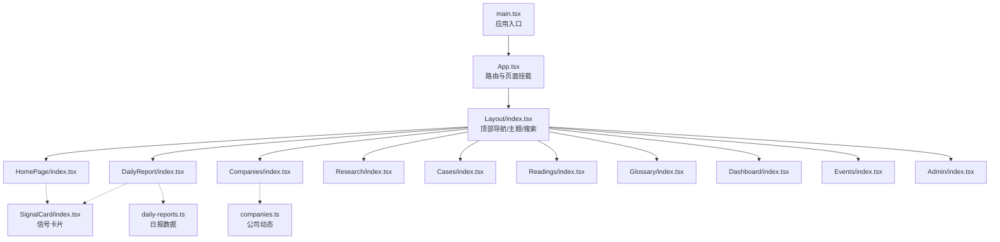
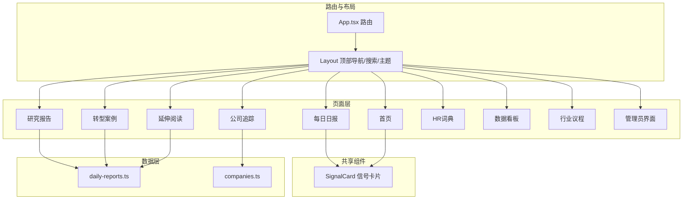
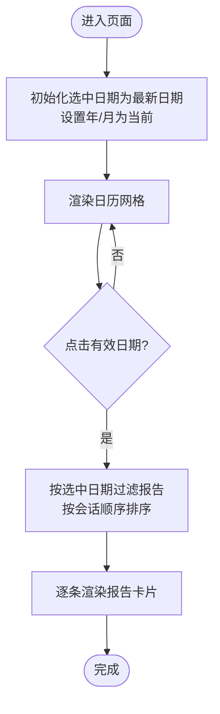
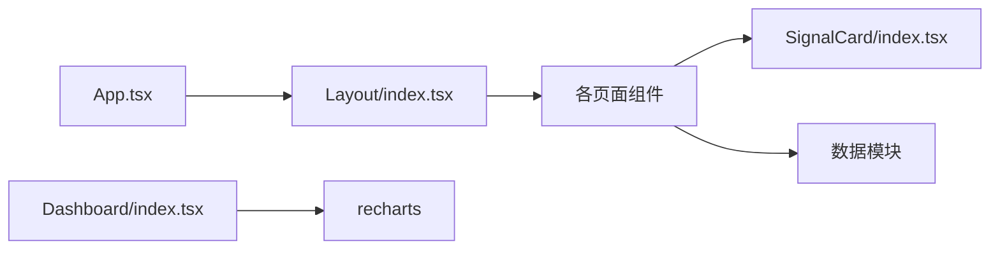

# 页面组件

<cite>
**本文引用的文件**
- [src/App.tsx](file://src/App.tsx)
- [src/main.tsx](file://src/main.tsx)
- [src/components/Layout/index.tsx](file://src/components/Layout/index.tsx)
- [src/components/SignalCard/index.tsx](file://src/components/SignalCard/index.tsx)
- [src/pages/HomePage/index.tsx](file://src/pages/HomePage/index.tsx)
- [src/pages/DailyReport/index.tsx](file://src/pages/DailyReport/index.tsx)
- [src/pages/Companies/index.tsx](file://src/pages/Companies/index.tsx)
- [src/pages/Research/index.tsx](file://src/pages/Research/index.tsx)
- [src/pages/Cases/index.tsx](file://src/pages/Cases/index.tsx)
- [src/pages/Readings/index.tsx](file://src/pages/Readings/index.tsx)
- [src/pages/Glossary/index.tsx](file://src/pages/Glossary/index.tsx)
- [src/pages/Dashboard/index.tsx](file://src/pages/Dashboard/index.tsx)
- [src/pages/Events/index.tsx](file://src/pages/Events/index.tsx)
- [src/pages/Admin/index.tsx](file://src/pages/Admin/index.tsx)
- [src/data/daily-reports.ts](file://src/data/daily-reports.ts)
- [src/data/companies.ts](file://src/data/companies.ts)
</cite>

## 目录
1. [简介](#简介)
2. [项目结构](#项目结构)
3. [核心组件](#核心组件)
4. [架构总览](#架构总览)
5. [详细组件分析](#详细组件分析)
6. [依赖分析](#依赖分析)
7. [性能考虑](#性能考虑)
8. [故障排查指南](#故障排查指南)
9. [结论](#结论)
10. [附录](#附录)

## 简介
本文件面向前端开发者与产品同学，系统化梳理本项目的页面组件，覆盖首页、每日日报、公司追踪、研究报告、转型案例、延伸阅读、HR词典、数据看板、行业议程、管理员界面等页面。文档从系统架构、组件关系、数据流、处理逻辑、集成点、错误处理与性能特性等维度进行深入解析，并提供页面间导航关系、状态传递与数据加载策略说明，以及页面开发模板与最佳实践。

## 项目结构
应用采用 React + Vite 架构，路由由 React Router 管理，页面统一包裹在布局组件中，全局状态通过应用状态仓库集中管理。数据以静态模块形式注入，部分页面使用图表库进行可视化展示。

**图示来源**
- [src/main.tsx:1-11](file://src/main.tsx#L1-L11)
- [src/App.tsx:14-34](file://src/App.tsx#L14-L34)
- [src/components/Layout/index.tsx:22-173](file://src/components/Layout/index.tsx#L22-L173)
- [src/components/SignalCard/index.tsx:26-111](file://src/components/SignalCard/index.tsx#L26-L111)
- [src/pages/HomePage/index.tsx:25-212](file://src/pages/HomePage/index.tsx#L25-L212)
- [src/pages/DailyReport/index.tsx:42-248](file://src/pages/DailyReport/index.tsx#L42-L248)
- [src/pages/Companies/index.tsx:13-68](file://src/pages/Companies/index.tsx#L13-L68)
- [src/pages/Research/index.tsx:25-243](file://src/pages/Research/index.tsx#L25-L243)
- [src/pages/Cases/index.tsx:11-95](file://src/pages/Cases/index.tsx#L11-L95)
- [src/pages/Readings/index.tsx:5-55](file://src/pages/Readings/index.tsx#L5-L55)
- [src/pages/Glossary/index.tsx:6-72](file://src/pages/Glossary/index.tsx#L6-L72)
- [src/pages/Dashboard/index.tsx:8-207](file://src/pages/Dashboard/index.tsx#L8-L207)
- [src/pages/Events/index.tsx:18-93](file://src/pages/Events/index.tsx#L18-L93)
- [src/pages/Admin/index.tsx:6-142](file://src/pages/Admin/index.tsx#L6-L142)
- [src/data/daily-reports.ts:3-454](file://src/data/daily-reports.ts#L3-L454)
- [src/data/companies.ts:3-52](file://src/data/companies.ts#L3-L52)

**章节来源**
- [src/main.tsx:1-11](file://src/main.tsx#L1-L11)
- [src/App.tsx:14-34](file://src/App.tsx#L14-L34)
- [src/components/Layout/index.tsx:22-173](file://src/components/Layout/index.tsx#L22-L173)

## 核心组件
- 应用入口与路由
  - 应用根节点在入口文件中挂载，路由定义了所有页面路径与嵌套路由，顶层统一包裹布局组件。
  - 导航栏支持键盘快捷键打开搜索、切换主题、移动端菜单折叠。
- 布局组件
  - 提供顶部导航、移动端菜单、搜索弹窗触发、主题切换与页脚。
  - 使用动画过渡保证页面切换的流畅性。
- 信号卡片组件
  - 通用卡片组件，支持优先级样式、展开详情、收藏、标签与关联公司链接。
  - 与应用状态仓库联动，支持收藏状态持久化。

**章节来源**
- [src/main.tsx:6-10](file://src/main.tsx#L6-L10)
- [src/App.tsx:14-34](file://src/App.tsx#L14-L34)
- [src/components/Layout/index.tsx:22-173](file://src/components/Layout/index.tsx#L22-L173)
- [src/components/SignalCard/index.tsx:26-111](file://src/components/SignalCard/index.tsx#L26-L111)

## 架构总览
页面组件围绕“布局-页面-数据”三层组织，页面间通过路由导航连接，部分页面共享通用组件（如信号卡片）。数据通过静态模块注入，部分页面使用第三方可视化库渲染图表。

**图示来源**
- [src/App.tsx:18-31](file://src/App.tsx#L18-L31)
- [src/components/Layout/index.tsx:11-20](file://src/components/Layout/index.tsx#L11-L20)
- [src/components/SignalCard/index.tsx:26-111](file://src/components/SignalCard/index.tsx#L26-L111)
- [src/data/daily-reports.ts:3-454](file://src/data/daily-reports.ts#L3-L454)
- [src/data/companies.ts:3-52](file://src/data/companies.ts#L3-L52)

## 详细组件分析

### 首页（HomePage）
- 核心功能
  - 展示最新日报摘要、今日精华信号、本周行动速查、板块导览与角色推荐路径。
  - 支持根据用户角色（CHRO/HRBP/学习者/OD）切换推荐导航路径。
- 数据需求
  - 依赖日报数据与板块配置，渲染信号卡片与行动计划表格。
- 组件结构
  - 使用动画库实现入场动画；表格与卡片结构清晰，响应式网格布局。
- 用户交互
  - 点击板块卡片跳转对应页面；点击推荐路径按钮设置角色并高亮当前角色。
- 状态传递
  - 通过应用状态仓库设置角色，影响后续页面的个性化展示。
- 数据加载策略
  - 静态导入数据，无需网络请求；按需渲染最新报告与动作清单。

**章节来源**
- [src/pages/HomePage/index.tsx:25-212](file://src/pages/HomePage/index.tsx#L25-L212)
- [src/data/daily-reports.ts:3-454](file://src/data/daily-reports.ts#L3-L454)

### 每日日报（DailyReport）
- 核心功能
  - 日历选择器按月浏览历史日报；按日期筛选当日多会话报告（上午基线/PM精读/自动版/可视化）。
  - 每份报告包含标题、会话标签、信源覆盖、信号列表与行动速查。
- 数据需求
  - 依赖日报数据集合，按日期与会话排序。
- 组件结构
  - 日历网格、日期头部、报告卡片、信号卡片、行动计划表格。
- 用户交互
  - 上一页/下一页切换月份；点击日期选择器；报告卡片逐条入场动画。
- 状态传递
  - 本地状态维护选中日期、年份与月份；会话顺序固定。
- 数据加载策略
  - 静态数据；按选中日期过滤并排序。

**图示来源**
- [src/pages/DailyReport/index.tsx:42-86](file://src/pages/DailyReport/index.tsx#L42-L86)
- [src/pages/DailyReport/index.tsx:58-64](file://src/pages/DailyReport/index.tsx#L58-L64)

**章节来源**
- [src/pages/DailyReport/index.tsx:42-248](file://src/pages/DailyReport/index.tsx#L42-L248)
- [src/data/daily-reports.ts:3-454](file://src/data/daily-reports.ts#L3-L454)

### 公司追踪（Companies）
- 核心功能
  - 展示公司与关键人物的动态更新，包含标题、公司/人物/日期、摘要、标签与颜色标识。
- 数据需求
  - 依赖公司动态数据模块。
- 组件结构
  - 卡片列表，每条动态包含图标、标题、元信息、摘要与标签云。
- 用户交互
  - 无交互；纯展示。
- 状态传递
  - 无状态；静态渲染。
- 数据加载策略
  - 静态导入，按序渲染。

**章节来源**
- [src/pages/Companies/index.tsx:13-68](file://src/pages/Companies/index.tsx#L13-L68)
- [src/data/companies.ts:3-52](file://src/data/companies.ts#L3-L52)

### 研究报告（Research）
- 核心功能
  - 切换“研究报告”与“延伸阅读”两个分区；支持展开/收起关键发现与编辑导读。
- 数据需求
  - 依赖研究报告与延伸阅读数据模块。
- 组件结构
  - 标签页切换、卡片列表、图标徽章、作者/机构/日期、摘要、标签、展开详情。
- 用户交互
  - 切换分区；点击“展开/收起”按钮；点击外部链接。
- 状态传递
  - 本地状态维护当前分区与展开项。
- 数据加载策略
  - 静态数据；按需渲染。

**章节来源**
- [src/pages/Research/index.tsx:25-243](file://src/pages/Research/index.tsx#L25-L243)

### 转型案例（Cases）
- 核心功能
  - 展示AI转型成功/失败/混合案例，标注结果类型与做对/做错要点、HR启示与标签。
- 数据需求
  - 依赖案例数据模块。
- 组件结构
  - 卡片列表，结果徽章、摘要、两列要点区、HR启示与标签。
- 用户交互
  - 无交互；纯展示。
- 状态传递
  - 无状态；静态渲染。
- 数据加载策略
  - 静态数据；按序渲染。

**章节来源**
- [src/pages/Cases/index.tsx:11-95](file://src/pages/Cases/index.tsx#L11-L95)

### 延伸阅读（Readings）
- 核心功能
  - 展示延伸阅读条目，包含标题、原文标题、来源/日期、摘要、精选摘录、编辑导读与标签。
- 数据需求
  - 依赖延伸阅读数据模块。
- 组件结构
  - 卡片列表，摘录气泡、编辑导读、标签云。
- 用户交互
  - 无交互；纯展示。
- 状态传递
  - 无状态；静态渲染。
- 数据加载策略
  - 静态数据；按序渲染。

**章节来源**
- [src/pages/Readings/index.tsx:5-55](file://src/pages/Readings/index.tsx#L5-L55)

### HR词典（Glossary）
- 核心功能
  - 支持中英文术语检索，展示术语、中文释义、示例与关联术语。
- 数据需求
  - 依赖词典数据模块。
- 组件结构
  - 搜索框、网格卡片、示例与关联术语。
- 用户交互
  - 输入框实时过滤；空结果提示。
- 状态传递
  - 本地状态维护查询词。
- 数据加载策略
  - 静态数据；客户端过滤。

**章节来源**
- [src/pages/Glossary/index.tsx:6-72](file://src/pages/Glossary/index.tsx#L6-L72)

### 数据看板（Dashboard）
- 核心功能
  - 展示KPI指标卡、趋势折线图与明细表格；支持折叠/展开明细表。
- 数据需求
  - 依赖仪表盘快照数据模块。
- 组件结构
  - KPI网格、响应式折线图、可折叠明细表卡片。
- 用户交互
  - 点击展开/收起明细表；图表交互提示。
- 状态传递
  - 本地状态维护展开状态；初始默认展开所有明细表。
- 数据加载策略
  - 静态数据；图表库渲染。

**章节来源**
- [src/pages/Dashboard/index.tsx:8-207](file://src/pages/Dashboard/index.tsx#L8-L207)

### 行业议程（Events）
- 核心功能
  - 展示行业活动日历，按日期排序，区分过去/即将开始/未来；显示相关性等级与倒计时。
- 数据需求
  - 依赖事件数据模块。
- 组件结构
  - 列表卡片，日期徽章、内容区、倒计时与相关性标签。
- 用户交互
  - 无交互；纯展示。
- 状态传递
  - 无状态；静态渲染。
- 数据加载策略
  - 静态数据；排序后渲染。

**章节来源**
- [src/pages/Events/index.tsx:18-93](file://src/pages/Events/index.tsx#L18-L93)

### 管理员界面（Admin）
- 核心功能
  - 概览统计、内容预览与质量审计三标签页；支持触发Pipeline。
- 数据需求
  - 依赖日报数据模块。
- 组件结构
  - 标签页、统计卡片、状态列表、预览卡片、审计检查项。
- 用户交互
  - 切换标签页；触发Pipeline按钮。
- 状态传递
  - 本地状态维护当前标签页。
- 数据加载策略
  - 静态数据；按需渲染。

**章节来源**
- [src/pages/Admin/index.tsx:6-142](file://src/pages/Admin/index.tsx#L6-L142)

### 信号卡片（SignalCard）
- 核心功能
  - 渲染单条信号，支持优先级徽章、收藏、展开详情、标签与关联公司。
- 数据需求
  - 依赖信号类型与应用状态仓库。
- 组件结构
  - 头部（表情/标题/优先级/来源）、摘要、标签、详情展开、关联公司。
- 用户交互
  - 收藏/取消收藏；展开/收起详情。
- 状态传递
  - 与应用状态仓库联动，维护收藏集合。
- 数据加载策略
  - 静态数据；按序渲染。

**章节来源**
- [src/components/SignalCard/index.tsx:26-111](file://src/components/SignalCard/index.tsx#L26-L111)

## 依赖分析
- 路由与页面
  - 路由在应用层集中定义，页面均在布局容器内渲染，保证导航与主题一致。
- 页面与数据
  - 页面通过静态数据模块注入，减少网络依赖，提高首屏性能。
- 页面与组件
  - 信号卡片作为跨页面复用组件，降低重复开发成本。
- 第三方库
  - 图表库用于数据看板趋势图；动画库用于页面切换与元素入场。

**图示来源**
- [src/App.tsx:18-31](file://src/App.tsx#L18-L31)
- [src/components/Layout/index.tsx:11-20](file://src/components/Layout/index.tsx#L11-L20)
- [src/components/SignalCard/index.tsx:26-111](file://src/components/SignalCard/index.tsx#L26-L111)
- [src/pages/Dashboard/index.tsx:63-87](file://src/pages/Dashboard/index.tsx#L63-L87)

**章节来源**
- [src/App.tsx:14-34](file://src/App.tsx#L14-L34)
- [src/components/Layout/index.tsx:22-173](file://src/components/Layout/index.tsx#L22-L173)

## 性能考虑
- 静态数据注入
  - 页面数据以静态模块导入，避免运行时网络请求，提升首屏渲染速度。
- 懒渲染与动画
  - 使用动画库对列表项进行延迟入场，改善感知性能；仅在必要时计算与渲染。
- 图表优化
  - 数据看板使用响应式图表容器，按需渲染；建议在大数据量时启用虚拟化或分页。
- 本地状态最小化
  - 日历与展开状态等局部状态尽量收敛，避免全局状态风暴。
- 主题与搜索
  - 主题切换与搜索弹窗通过轻量状态控制，不阻塞页面渲染。

## 故障排查指南
- 路由无法访问
  - 检查路由定义与路径是否与页面注册一致；确认布局包裹正确。
- 页面空白
  - 检查数据模块是否存在；确认静态导入路径正确。
- 信号卡片无收藏状态
  - 检查应用状态仓库的收藏集合与切换函数是否正常；确认卡片传入的信号ID唯一。
- 日历不可选
  - 检查日期格式与集合去重逻辑；确认日历网格渲染条件。
- 图表不显示
  - 检查图表容器尺寸与数据结构；确认响应式容器可用。

**章节来源**
- [src/App.tsx:18-31](file://src/App.tsx#L18-L31)
- [src/components/SignalCard/index.tsx:26-111](file://src/components/SignalCard/index.tsx#L26-L111)
- [src/pages/DailyReport/index.tsx:42-86](file://src/pages/DailyReport/index.tsx#L42-L86)
- [src/pages/Dashboard/index.tsx:63-87](file://src/pages/Dashboard/index.tsx#L63-L87)

## 结论
本项目页面组件以布局为中心、页面为焦点、数据为驱动，形成清晰的层次结构。通过静态数据注入与通用组件复用，实现了良好的可维护性与性能表现。建议在后续迭代中进一步完善数据层抽象、引入缓存与分页策略，并增强错误边界与加载态反馈，以提升用户体验与稳定性。

## 附录

### 页面间导航关系与状态传递
- 首页
  - 导航至“每日日报”、“公司追踪”、“数据看板”等；通过角色状态影响推荐路径。
- 每日日报
  - 日历选择日期与会话；跳转至“转型案例”、“研究报告”等。
- 研究报告/延伸阅读
  - 通过标签页切换；支持外部链接跳转。
- HR词典
  - 搜索过滤；无页面跳转。
- 数据看板
  - 展示KPI与趋势；明细表可折叠。
- 行业议程
  - 日历列表；无页面跳转。
- 管理员界面
  - 概览/预览/审计三标签；触发Pipeline。

**章节来源**
- [src/pages/HomePage/index.tsx:10-15](file://src/pages/HomePage/index.tsx#L10-L15)
- [src/pages/DailyReport/index.tsx:173-239](file://src/pages/DailyReport/index.tsx#L173-L239)
- [src/pages/Research/index.tsx:25-243](file://src/pages/Research/index.tsx#L25-L243)
- [src/pages/Glossary/index.tsx:6-72](file://src/pages/Glossary/index.tsx#L6-L72)
- [src/pages/Dashboard/index.tsx:8-207](file://src/pages/Dashboard/index.tsx#L8-L207)
- [src/pages/Events/index.tsx:18-93](file://src/pages/Events/index.tsx#L18-L93)
- [src/pages/Admin/index.tsx:6-142](file://src/pages/Admin/index.tsx#L6-L142)

### 页面开发模板与最佳实践
- 页面模板
  - 使用布局容器包裹；按需引入动画与通用组件；静态数据导入；合理拆分列表项与详情。
- 最佳实践
  - 保持路由与页面命名一致性；统一使用图标与颜色规范；对长列表启用懒渲染与骨架屏；对图表设置占位与错误兜底；对搜索与过滤提供空态提示。
- 状态管理
  - 将可复用的状态下沉至应用状态仓库；页面内状态尽量局部化；避免跨页面共享复杂状态。