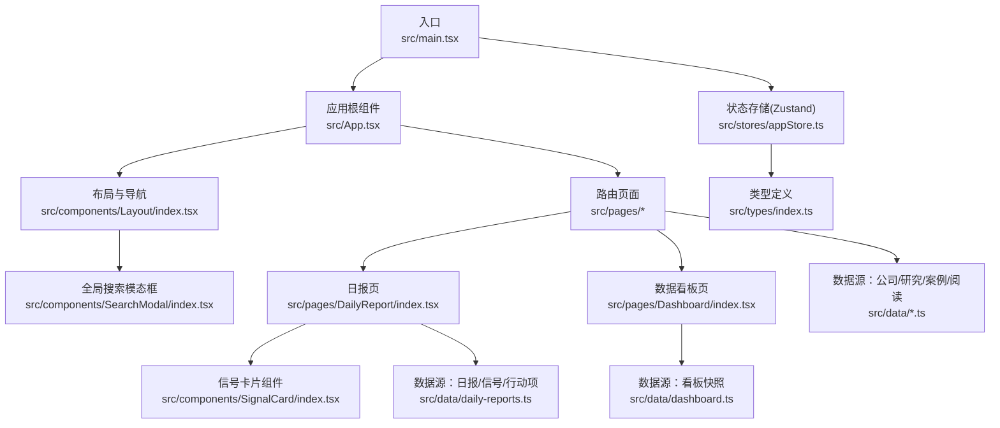
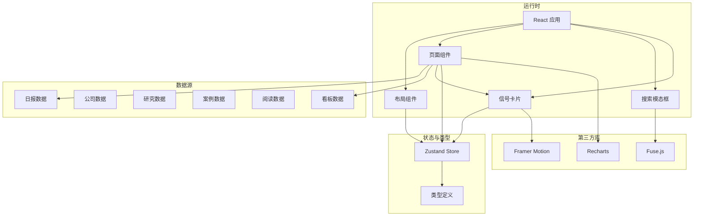
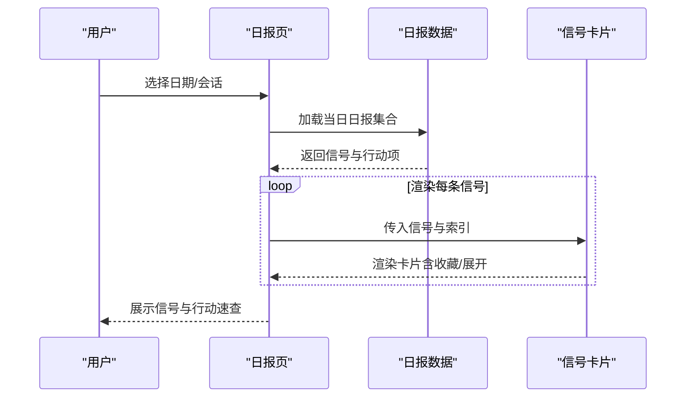
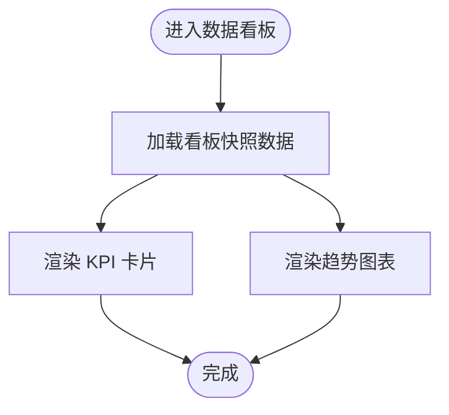
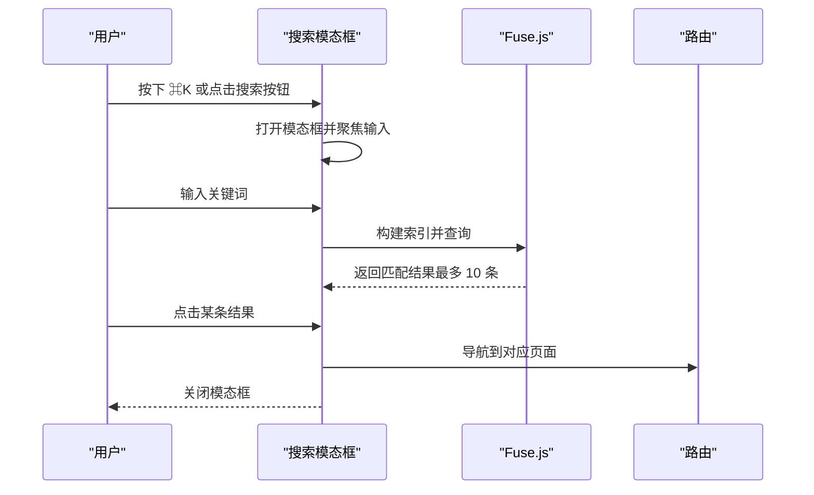
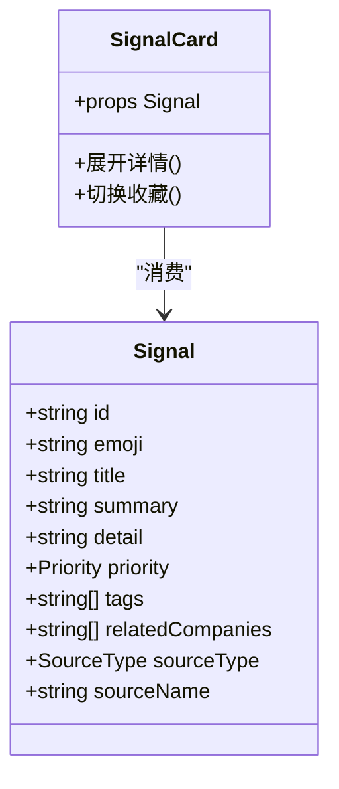
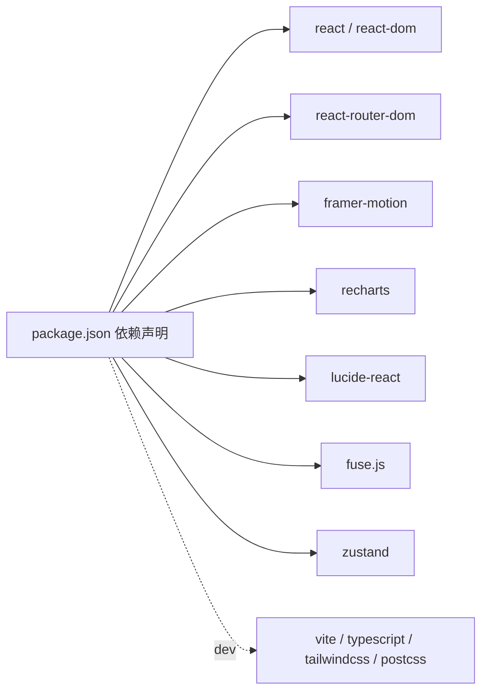

# 项目概述

<cite>
**本文引用的文件**
- [package.json](file://package.json)
- [src/main.tsx](file://src/main.tsx)
- [src/App.tsx](file://src/App.tsx)
- [src/components/Layout/index.tsx](file://src/components/Layout/index.tsx)
- [src/components/SearchModal/index.tsx](file://src/components/SearchModal/index.tsx)
- [src/components/SignalCard/index.tsx](file://src/components/SignalCard/index.tsx)
- [src/stores/appStore.ts](file://src/stores/appStore.ts)
- [src/types/index.ts](file://src/types/index.ts)
- [src/pages/DailyReport/index.tsx](file://src/pages/DailyReport/index.tsx)
- [src/pages/Dashboard/index.tsx](file://src/pages/Dashboard/index.tsx)
- [src/data/daily-reports.ts](file://src/data/daily-reports.ts)
- [src/data/dashboard.ts](file://src/data/dashboard.ts)
- [src/data/companies.ts](file://src/data/companies.ts)
- [src/data/research.ts](file://src/data/research.ts)
- [src/data/cases.ts](file://src/data/cases.ts)
- [src/data/readings.ts](file://src/data/readings.ts)
</cite>

## 目录
1. [引言](#引言)
2. [项目结构](#项目结构)
3. [核心组件](#核心组件)
4. [架构总览](#架构总览)
5. [详细组件分析](#详细组件分析)
6. [依赖关系分析](#依赖关系分析)
7. [性能考量](#性能考量)
8. [故障排查指南](#故障排查指南)
9. [结论](#结论)
10. [附录](#附录)

## 引言
未来组织·HR洞察日报 v2.0 是一个面向人力资源专业人士的智能信息聚合平台，旨在帮助 HR 从业者、组织发展专家与企业管理者快速把握组织演变趋势。项目通过整合六大类权威数据源（咨询机构、科技公司、学术研究、智库、风险投资、HR媒体、中国本土），提供“信号识别 + 个性化推荐”的洞察体系，辅以可交互的数据看板与检索系统，实现“每天 10 秒掌握组织演变”的目标。

价值主张
- 六大类 19+ 权威数据源，构建可信、多源、可交叉验证的信息基线
- 信号优先级标注与来源标签，帮助用户快速筛选与决策
- 个性化收藏与阅读历史，形成个人化的“信号档案”
- 搜索与标签过滤，支持跨板块、跨主题的高效检索
- 数据看板与趋势图表，提供关键指标的即时概览

目标用户
- CHRO、HRBP、OD 专家：用于战略洞察与组织设计参考
- 企业管理者：用于业务与人才策略联动
- 学习者与研究者：用于知识积累与方法论提炼

## 项目结构
前端采用 React + Vite 架构，使用 TypeScript 提供类型安全，状态管理基于 Zustand，UI 动画与交互由 Framer Motion 提供，图表可视化使用 Recharts，全文检索采用 Fuse.js。页面路由基于 react-router-dom，主题与用户偏好持久化存储在本地。

**图示来源**
- [src/main.tsx:1-11](file://src/main.tsx#L1-L11)
- [src/App.tsx:1-36](file://src/App.tsx#L1-L36)
- [src/components/Layout/index.tsx:1-175](file://src/components/Layout/index.tsx#L1-L175)
- [src/components/SearchModal/index.tsx:1-156](file://src/components/SearchModal/index.tsx#L1-L156)
- [src/components/SignalCard/index.tsx:1-111](file://src/components/SignalCard/index.tsx#L1-L111)
- [src/stores/appStore.ts:1-93](file://src/stores/appStore.ts#L1-L93)
- [src/types/index.ts:1-194](file://src/types/index.ts#L1-L194)
- [src/pages/DailyReport/index.tsx:1-122](file://src/pages/DailyReport/index.tsx#L1-L122)
- [src/pages/Dashboard/index.tsx:1-82](file://src/pages/Dashboard/index.tsx#L1-L82)
- [src/data/daily-reports.ts:1-203](file://src/data/daily-reports.ts#L1-L203)
- [src/data/dashboard.ts:1-30](file://src/data/dashboard.ts#L1-L30)
- [src/data/companies.ts:1-53](file://src/data/companies.ts#L1-L53)
- [src/data/research.ts:1-53](file://src/data/research.ts#L1-L53)
- [src/data/cases.ts:1-63](file://src/data/cases.ts#L1-L63)
- [src/data/readings.ts:1-33](file://src/data/readings.ts#L1-L33)

**章节来源**
- [package.json:1-36](file://package.json#L1-L36)
- [src/main.tsx:1-11](file://src/main.tsx#L1-L11)
- [src/App.tsx:1-36](file://src/App.tsx#L1-L36)

## 核心组件
- 应用入口与路由：负责初始化 React DOM、配置 BrowserRouter 与页面路由，统一挂载布局与搜索模态框。
- 布局与导航：提供顶部导航栏、移动端菜单、主题切换、全局搜索快捷键监听与页面过渡动画。
- 搜索模态框：集成 Fuse.js 进行全文检索，覆盖日报信号、公司更新、研究报告、转型案例、延伸阅读与词典条目，支持键盘快捷键与结果高亮。
- 信号卡片：展示信号标题、摘要、优先级、来源、标签与关联公司，支持展开详情与收藏。
- 状态存储：Zustand 管理主题、用户角色、阅读历史、收藏、搜索状态与标签过滤。
- 页面模块：日报页按日期与会话维度展示信号与行动速查；数据看板页展示关键指标与趋势图。

**章节来源**
- [src/components/Layout/index.tsx:1-175](file://src/components/Layout/index.tsx#L1-L175)
- [src/components/SearchModal/index.tsx:1-156](file://src/components/SearchModal/index.tsx#L1-L156)
- [src/components/SignalCard/index.tsx:1-111](file://src/components/SignalCard/index.tsx#L1-L111)
- [src/stores/appStore.ts:1-93](file://src/stores/appStore.ts#L1-L93)
- [src/pages/DailyReport/index.tsx:1-122](file://src/pages/DailyReport/index.tsx#L1-L122)
- [src/pages/Dashboard/index.tsx:1-82](file://src/pages/Dashboard/index.tsx#L1-L82)

## 架构总览
系统采用“页面路由 + 组件化 UI + 数据源 + 状态存储”的分层架构。数据通过 TypeScript 类型约束进行强约束，页面通过 props 传递数据，组件内部通过 Zustand 管理轻量状态，第三方库承担特定职责（Framer Motion 负责动画、Recharts 负责图表、Fuse.js 负责检索）。

**图示来源**
- [src/App.tsx:1-36](file://src/App.tsx#L1-L36)
- [src/components/Layout/index.tsx:1-175](file://src/components/Layout/index.tsx#L1-L175)
- [src/components/SearchModal/index.tsx:1-156](file://src/components/SearchModal/index.tsx#L1-L156)
- [src/components/SignalCard/index.tsx:1-111](file://src/components/SignalCard/index.tsx#L1-L111)
- [src/stores/appStore.ts:1-93](file://src/stores/appStore.ts#L1-L93)
- [src/types/index.ts:1-194](file://src/types/index.ts#L1-L194)
- [src/pages/DailyReport/index.tsx:1-122](file://src/pages/DailyReport/index.tsx#L1-L122)
- [src/pages/Dashboard/index.tsx:1-82](file://src/pages/Dashboard/index.tsx#L1-L82)
- [src/data/daily-reports.ts:1-203](file://src/data/daily-reports.ts#L1-L203)
- [src/data/dashboard.ts:1-30](file://src/data/dashboard.ts#L1-L30)
- [src/data/companies.ts:1-53](file://src/data/companies.ts#L1-L53)
- [src/data/research.ts:1-53](file://src/data/research.ts#L1-L53)
- [src/data/cases.ts:1-63](file://src/data/cases.ts#L1-L63)
- [src/data/readings.ts:1-33](file://src/data/readings.ts#L1-L33)

## 详细组件分析

### 日报页（DailyReport）
- 功能要点
  - 按日期筛选日报，支持 AM/PM/Auto/Visual 多会话视图
  - 展示来源覆盖统计与达标状态
  - 信号卡片列表，支持展开详情与收藏
  - 行动速查表格，按优先级呈现可执行建议
- 数据来源
  - 日报数据：包含信号、行动项、来源覆盖等
  - 信号卡片：复用通用组件，统一优先级与样式
- 交互体验
  - 使用 Framer Motion 提供卡片入场动画
  - 支持收藏与阅读历史的状态联动

**图示来源**
- [src/pages/DailyReport/index.tsx:1-122](file://src/pages/DailyReport/index.tsx#L1-L122)
- [src/data/daily-reports.ts:1-203](file://src/data/daily-reports.ts#L1-L203)
- [src/components/SignalCard/index.tsx:1-111](file://src/components/SignalCard/index.tsx#L1-L111)

**章节来源**
- [src/pages/DailyReport/index.tsx:1-122](file://src/pages/DailyReport/index.tsx#L1-L122)
- [src/data/daily-reports.ts:1-203](file://src/data/daily-reports.ts#L1-L203)

### 数据看板（Dashboard）
- 功能要点
  - 展示关键指标卡片（含趋势方向）
  - 响应式折线图展示趋势序列
- 数据来源
  - 看板快照：包含 KPI 列表与趋势序列

**图示来源**
- [src/pages/Dashboard/index.tsx:1-82](file://src/pages/Dashboard/index.tsx#L1-L82)
- [src/data/dashboard.ts:1-30](file://src/data/dashboard.ts#L1-L30)

**章节来源**
- [src/pages/Dashboard/index.tsx:1-82](file://src/pages/Dashboard/index.tsx#L1-L82)
- [src/data/dashboard.ts:1-30](file://src/data/dashboard.ts#L1-L30)

### 搜索模态框（SearchModal）
- 功能要点
  - 全局搜索：支持 ⌘K 快捷键打开
  - 多板块索引：日报信号、公司更新、研究报告、转型案例、延伸阅读、词典条目
  - 结果高亮与路径跳转
- 检索算法
  - 使用 Fuse.js 构建索引，支持模糊匹配与阈值控制

**图示来源**
- [src/components/SearchModal/index.tsx:1-156](file://src/components/SearchModal/index.tsx#L1-L156)
- [src/stores/appStore.ts:1-93](file://src/stores/appStore.ts#L1-L93)

**章节来源**
- [src/components/SearchModal/index.tsx:1-156](file://src/components/SearchModal/index.tsx#L1-L156)
- [src/stores/appStore.ts:1-93](file://src/stores/appStore.ts#L1-L93)

### 信号卡片（SignalCard）
- 功能要点
  - 优先级边框与徽标
  - 标签云展示
  - 可展开详情与收藏按钮
  - 动画入场与高度自适应展开
- 状态联动
  - 与全局收藏状态同步

**图示来源**
- [src/components/SignalCard/index.tsx:1-111](file://src/components/SignalCard/index.tsx#L1-L111)
- [src/types/index.ts:17-31](file://src/types/index.ts#L17-L31)

**章节来源**
- [src/components/SignalCard/index.tsx:1-111](file://src/components/SignalCard/index.tsx#L1-L111)
- [src/types/index.ts:17-31](file://src/types/index.ts#L17-L31)

### 布局与导航（Layout）
- 功能要点
  - 顶部导航与移动端菜单
  - 主题循环切换（浅色/深色/系统）
  - 全局搜索快捷键监听
  - 页面切换动画与活跃状态高亮
- 交互细节
  - 键盘监听与状态初始化
  - 移动端抽屉式菜单

**章节来源**
- [src/components/Layout/index.tsx:1-175](file://src/components/Layout/index.tsx#L1-L175)

### 状态存储（Zustand）
- 功能要点
  - 主题、用户角色、阅读历史、收藏、搜索开关、标签过滤
  - 本地持久化（仅部分字段）
- 性能与一致性
  - 轻量状态管理，避免全局重渲染
  - 与组件通过 hooks 解耦

**章节来源**
- [src/stores/appStore.ts:1-93](file://src/stores/appStore.ts#L1-L93)

## 依赖关系分析
- 运行时依赖
  - React/ReactDOM：应用框架
  - react-router-dom：页面路由
  - framer-motion：动画与过渡
  - recharts：图表可视化
  - lucide-react：图标
  - html2canvas：截图（脚本使用）
- 开发依赖
  - Vite、TypeScript、TailwindCSS、PostCSS、TSX 等

**图示来源**
- [package.json:12-34](file://package.json#L12-L34)

**章节来源**
- [package.json:1-36](file://package.json#L1-L36)

## 性能考量
- 渲染优化
  - 使用 Framer Motion 的局部动画，避免全局重排
  - 列表项入场延迟（按索引延时）改善感知性能
- 状态管理
  - Zustand 仅保存必要字段，减少订阅范围
  - 本地持久化降低首屏计算
- 搜索性能
  - Fuse.js 索引预构建，查询阈值与返回数量限制
- 图表性能
  - Recharts 响应式容器，按需渲染

[本节为通用指导，无需列出具体文件来源]

## 故障排查指南
- 搜索无结果
  - 检查搜索索引构建函数是否包含目标板块数据
  - 确认 Fuse.js 配置阈值与 keys 设置
- 主题切换无效
  - 检查系统主题偏好与 store 中 resolvedTheme 的计算
  - 确认根节点 HTML 上的 dark 类是否正确添加
- 页面切换动画异常
  - 检查 Outlet 包裹与 key 值是否随路由变化
- 收藏/阅读历史不同步
  - 确认收藏与历史操作是否调用 store 的相应方法
  - 检查持久化中间件是否生效

**章节来源**
- [src/components/SearchModal/index.tsx:22-45](file://src/components/SearchModal/index.tsx#L22-L45)
- [src/stores/appStore.ts:35-92](file://src/stores/appStore.ts#L35-L92)
- [src/components/Layout/index.tsx:28-51](file://src/components/Layout/index.tsx#L28-L51)

## 结论
未来组织·HR洞察日报 v2.0 以“信号识别 + 个性化推荐 + 多源交叉验证”为核心，结合 React/Vite 技术栈与 Zustand 状态管理，构建了一个可扩展、可维护且具备良好交互体验的 HR 洞察平台。其数据驱动的日报、可交互的数据看板与强大的搜索能力，能够帮助 HR 从业者在信息洪流中快速定位关键信号，支撑组织决策与人才策略。

[本节为总结性内容，无需列出具体文件来源]

## 附录
- 数据模型概览（类型定义）
  - 信号、行动项、来源覆盖、每日日报、公司更新、研究报告、转型案例、延伸阅读、词典条目、看板快照、事件、板块导航、用户角色与偏好等
- 数据源清单
  - 日报信号与行动项、公司动态、研究报告、转型案例、延伸阅读、词典条目、看板快照

**章节来源**
- [src/types/index.ts:1-194](file://src/types/index.ts#L1-L194)
- [src/data/daily-reports.ts:1-203](file://src/data/daily-reports.ts#L1-L203)
- [src/data/companies.ts:1-53](file://src/data/companies.ts#L1-L53)
- [src/data/research.ts:1-53](file://src/data/research.ts#L1-L53)
- [src/data/cases.ts:1-63](file://src/data/cases.ts#L1-L63)
- [src/data/readings.ts:1-33](file://src/data/readings.ts#L1-L33)
- [src/data/dashboard.ts:1-30](file://src/data/dashboard.ts#L1-L30)